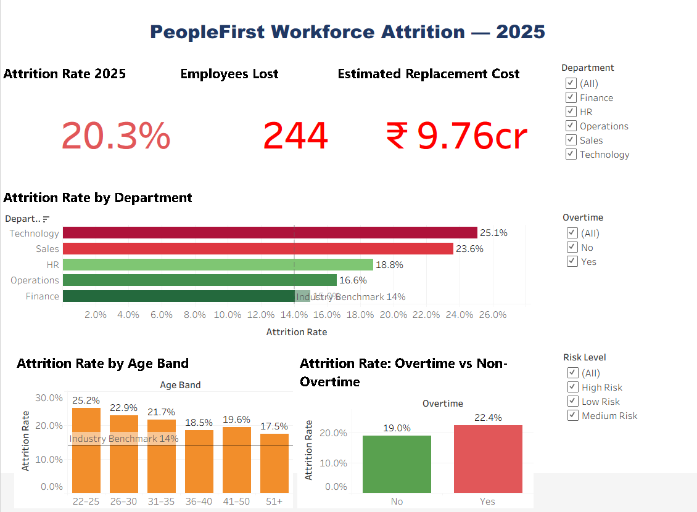
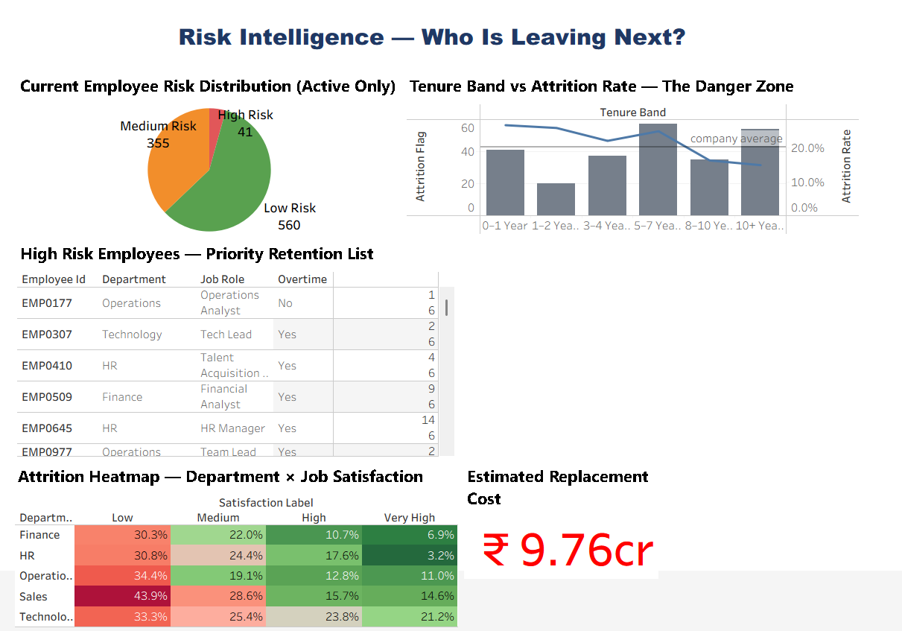

# 🧑‍💼 PeopleFirst HR — Workforce Attrition Analysis 2025


> **A full-cycle HR analytics project investigating a 20.3% employee attrition rate at a fictional consulting firm — from SQL segmentation to Python EDA to an interactive Tableau dashboard.**

---

## 📌 Table of Contents

- [Business Background](#-business-background)
- [Problem Statement](#-problem-statement)
- [Stakeholder Questions](#-stakeholder-questions)
- [Dataset](#-dataset)
- [Project Workflow](#-project-workflow)
- [Key Findings](#-key-findings)
- [Hypothesis Validation](#-hypothesis-validation)
- [Tools & Skills Used](#-tools--skills-used)
- [Project Structure](#-project-structure)
- [Dashboard Preview](#-dashboard-preview)
- [How to Run](#-how-to-run)
- [Recommendations](#-recommendations)
- [Author](#-author)

---

## 🏢 Business Background

**PeopleFirst HR Consulting** is a mid-size consulting firm based in Gurugram, Haryana with 1,200+ employees across five departments — Sales, Technology, Finance, HR, and Operations. The company provides HR outsourcing, payroll management, and talent acquisition services to corporate clients across India.

It is **January 2026**. The CHRO, **Ms. Kavya Iyer**, has flagged a serious concern in the annual board review: PeopleFirst lost **244 employees in 2025** — a 20.3% attrition rate, well above the industry benchmark of 13–15%.

**I was assigned as the People Data Analyst on this project.**

---

## ❓ Problem Statement

> _"We are losing 1 in 5 employees every year — far above the industry norm. We need to understand who is leaving, why they are leaving, and what it is costing us — so we can act before it gets worse."_
>
> — CHRO, PeopleFirst HR Consulting

---

## 🙋 Stakeholder Questions

| #   | Asked By     | Question                                                    |
| --- | ------------ | ----------------------------------------------------------- |
| 1   | CHRO         | What is our actual attrition rate vs industry benchmark?    |
| 2   | CHRO         | Which department is bleeding the most talent?               |
| 3   | HR Head      | Is attrition higher among a particular age group or gender? |
| 4   | HR Head      | Are employees leaving because of salary?                    |
| 5   | Dept Heads   | Are we losing people in their first 2 years?                |
| 6   | Dept Heads   | Do overtime and frequent travel increase attrition?         |
| 7   | Finance Head | What is the financial cost of this attrition?               |
| 8   | CEO          | Which active employees are most at risk of leaving next?    |

---

## 📁 Dataset

**File:** `data/peoplefirst_hr_2025.csv`
**Records:** 1,200 employees (active + exited)
**Features:** 21 columns

| Column                     | Type    | Description                                    |
| -------------------------- | ------- | ---------------------------------------------- |
| `employee_id`              | VARCHAR | Unique ID (EMP0001 onwards)                    |
| `age`                      | INT     | Employee age (22–58)                           |
| `gender`                   | VARCHAR | Male / Female                                  |
| `marital_status`           | VARCHAR | Single / Married / Divorced                    |
| `department`               | VARCHAR | Sales / Technology / Finance / HR / Operations |
| `job_role`                 | VARCHAR | Specific role within department                |
| `education_level`          | VARCHAR | Graduate / Post-Graduate / Doctorate           |
| `years_at_company`         | INT     | Total tenure in years                          |
| `years_in_role`            | INT     | Years in current role                          |
| `monthly_salary`           | DECIMAL | Monthly CTC in INR                             |
| `salary_hike_pct`          | INT     | Last year's salary hike %                      |
| `job_satisfaction`         | INT     | 1 (Low) to 4 (Very High)                       |
| `work_life_balance`        | INT     | 1 (Bad) to 4 (Excellent)                       |
| `environment_satisfaction` | INT     | 1 (Low) to 4 (Very High)                       |
| `overtime`                 | VARCHAR | Yes / No                                       |
| `business_travel`          | VARCHAR | No Travel / Rarely / Frequently                |
| `num_companies_worked`     | INT     | Number of previous employers                   |
| `distance_from_home_km`    | INT     | Commute distance in KM                         |
| `performance_rating`       | INT     | 1 (Low) to 4 (Outstanding)                     |
| `training_hours_last_year` | INT     | Training hours in last year                    |
| `attrition`                | VARCHAR | Yes = left, No = active                        |

---

## 🔄 Project Workflow

```
Raw Data (CSV)
     │
     ▼
Phase 1 — SQL Analysis (MySQL)
  └── 15 queries across 8 sections
  └── Attrition by dept, age, salary, tenure, overtime
  └── Risk score model for active employees
     │
     ▼
Phase 2 — Python EDA (Pandas · NumPy · Matplotlib · Seaborn)
  └── 8 charts — overview, demographics, salary, tenure, workload
  └── Correlation heatmap — what drives attrition most?
  └── Risk profile — who is most likely to leave next?
  └── Hypothesis validation — 8 hypotheses tested
     │
     ▼
Phase 3 — Tableau Dashboard
  └── 2-page interactive dashboard
  └── 10 sheets — KPI cards, bar charts, heatmap, pie, table
  └── Department filter for drill-down
  └── Risk Intelligence page for HR action
```

---

## 🔍 Key Findings

### 1. Attrition at 20.3% — 6.3 Points Above Benchmark

The company is losing 1 in 5 employees annually vs the industry standard of 1 in 7. Total replacement cost estimated at **₹9.76 Crore** for 2025 alone.

### 2. Technology & Sales Are Crisis Departments

- Technology: **25.1%** attrition — highest in the company
- Sales: **23.6%** attrition — second highest
- Finance: **15.0%** — closest to benchmark, most stable

### 3. Overtime Is the Biggest Workload Driver

Employees working overtime leave at a significantly higher rate than non-overtime employees. Technology and Sales have the highest overtime concentration — a direct double link.

### 4. The 0–2 Year Tenure Band Is the Danger Zone

Employees in their first two years show the highest attrition rate — indicating an onboarding and early engagement problem rather than a compensation problem.

### 5. Low Job Satisfaction Strongly Predicts Attrition

Employees with satisfaction score 1–2 leave at nearly double the rate of those with score 3–4. This is the most actionable lever HR can pull directly.

### 6. 41 Active Employees Are Currently HIGH RISK

Using an 8-factor risk score model, 41 active employees have 5+ red flags. If they all leave, the additional replacement cost would be **₹1.64 Crore**.

---

## ✅ Hypothesis Validation

| Hypothesis                              | Result       | Evidence                                    |
| --------------------------------------- | ------------ | ------------------------------------------- |
| H1: Technology has highest attrition    | ✅ Confirmed | Tech = 25.1%, highest of all depts          |
| H2: Employees aged 25–32 leave more     | ✅ Confirmed | 22–25 band = highest attrition rate         |
| H3: Overtime = higher attrition         | ✅ Confirmed | Overtime employees leave significantly more |
| H4: Low satisfaction predicts attrition | ✅ Confirmed | Low sat = nearly 2x attrition rate          |
| H5: 0–2 year tenure = danger zone       | ✅ Confirmed | Early tenure band shows highest rate        |
| H6: Frequent travellers leave more      | ✅ Confirmed | Frequent > Rarely > No Travel               |
| H7: Low hike % → higher attrition       | ✅ Confirmed | Below 8% hike band has highest attrition    |
| H8: Single employees leave more         | ✅ Confirmed | Singles > Married > Divorced                |

---

## 🛠 Tools & Skills Used

### SQL / MySQL

- Conditional counting — `SUM(CASE WHEN attrition='Yes' THEN 1 ELSE 0 END)`
- Age and tenure binning with `CASE WHEN`
- `NULLIF()` for safe division
- Multi-condition cross-tab analysis
- Subquery-based risk level grouping
- Window functions — `SUM() OVER()`
- Leavers vs stayers salary comparison

### Python (Pandas · NumPy · Matplotlib · Seaborn)

- `pd.cut()` for binning continuous variables
- `.map()` for label encoding
- Boolean arithmetic for risk score calculation
- Multi-panel `plt.subplots()` layouts
- Dual Y-axis charts with `twinx()`
- `sns.heatmap()` with triangular mask
- Box plots with `patch_artist`
- Hypothesis validation with real numbers

### Tableau

- 9 calculated fields — IF/ELSEIF logic, aggregations
- Dual axis combo chart (bars + line)
- Red-Green diverging colour palette with custom center
- Reference lines at 14% benchmark
- Pie chart with custom colours
- Heatmap (Square marks)
- Use as Filter for interactivity
- Floating dashboard layout

---

## 📂 Project Structure

```
project2-hr-attrition-analysis/
│
├── data/
│   └── peoplefirst_hr_2025.csv          ← 1,200 employee records, 21 features
│
├── sql/
│   └── peoplefirst_analysis.sql         ← 15 queries across 8 sections
│
├── notebooks/
│   └── peoplefirst_eda.ipynb            ← Full EDA, 8 charts, hypothesis validation
│
├── tableau/
│   └── peoplefirst_dashboard.twbx       ← 2-page interactive dashboard, 10 sheets
│
├── screenshots/
│   ├── dashboard_page1.png              ← Attrition Overview dashboard
│   ├── dashboard_page2.png              ← Risk Intelligence dashboard
│   └── eda_plots/
│       ├── plot_01_overview.png
│       ├── plot_02_department.png
│       ├── plot_03_demographics.png
│       ├── plot_04_salary_satisfaction.png
│       ├── plot_05_tenure.png
│       ├── plot_06_workload.png
│       ├── plot_07_correlation.png
│       └── plot_08_risk_profile.png
│
└── README.md                            ← you are here
```

---

## 📸 Dashboard Preview

### Dashboard Page 1 — Attrition Overview



### Dashboard Page 2 — Risk Intelligence



**Dashboard features:**

- 3 KPI cards — Attrition Rate, Employees Lost, Replacement Cost
- Department attrition bar chart with Red-Green diverging colour
- Age band and overtime impact charts
- Tenure danger zone combo chart
- Risk level pie chart (active employees only)
- Satisfaction heatmap — Department × Job Satisfaction
- High Risk Employee table — 41 priority retention cases
- Department filter for real-time drill-down

---

## ▶ How to Run

### SQL

1. Open **MySQL Workbench** or **DBeaver**
2. Run `sql/peoplefirst_analysis.sql` — creates database, table, and all queries
3. Import `data/peoplefirst_hr_2025.csv` via Table Data Import Wizard
4. Run each section to explore attrition patterns

### Python Notebook

1. Place `peoplefirst_hr_2025.csv` and `peoplefirst_eda.ipynb` in the **same folder**
2. Open in **VS Code** (with Jupyter extension) or **Jupyter Notebook**
3. Install libraries: `pip install pandas numpy matplotlib seaborn`
4. Run all cells with **Shift + Enter** or **Run All**
5. All 8 charts will render inline and save as `.png` files

### Tableau

1. Open `tableau/peoplefirst_dashboard.twbx` in **Tableau Desktop** or **Tableau Public**
2. If data connection breaks, re-point to `data/peoplefirst_hr_2025.csv`
3. Use the **Department filter** to drill into specific departments
4. Page 2 shows the Risk Intelligence view for HR action

---

## 💡 Recommendations

| Priority      | Action                                       | Owner          | Expected Impact                |
| ------------- | -------------------------------------------- | -------------- | ------------------------------ |
| 🔴 Immediate  | Cap overtime in Technology & Sales           | Dept Heads     | Reduce burnout-driven exits    |
| 🔴 Immediate  | Launch structured 90-day onboarding          | HR Head        | Reduce 0–2 yr attrition        |
| 🟡 Short-term | Set minimum 10% salary hike floor            | Finance + HR   | Reduce pay-driven exits        |
| 🟡 Short-term | Mandatory satisfaction survey + action plans | All Dept Heads | Track and improve scores       |
| 🟢 Long-term  | Internal mobility programme for Tech & Sales | CHRO           | Retain talent, reduce poaching |

---

## 👤 Author

**Vijay**
BCA Graduate | Aspiring Data Analyst

📧 vjv241620@gmail.com
🔗 [LinkedIn](https://linkedin.com/in/vijay-vj-286b84386)
🌐 [Portfolio](https://vijay543vj.github.io)
💻 [GitHub](https://github.com/vijay543vj)

---

⭐ _If you found this project useful, consider giving it a star on GitHub!_
